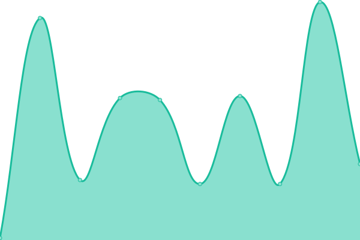

# [📈 Live Status](https://joshq00.github.io/chi-uptime): <!--live status--> **🟧 Partial outage**

This repository contains the open-source uptime monitor and status page for [Josh Quintana](https://joshq00.github.io/chi-uptime), powered by [Upptime](https://github.com/upptime/upptime).

With [Upptime](https://upptime.js.org), you can get your own unlimited and free uptime monitor and status page, powered entirely by a GitHub repository. We use [Issues](https://github.com/joshq00/chi-uptime/issues) as incident reports, [Actions](https://github.com/joshq00/chi-uptime/actions) as uptime monitors, and [Pages](https://joshq00.github.io/chi-uptime) for the status page.

<!--start: status pages-->
<!-- This summary is generated by Upptime (https://github.com/upptime/upptime) -->
<!-- Do not edit this manually, your changes will be overwritten -->
<!-- prettier-ignore -->
| URL | Status | History | Response Time | Uptime |
| --- | ------ | ------- | ------------- | ------ |
|  [hwb](http://highwaybenefits.com) | 🟩 Up | [hwb.yml](https://github.com/joshq00/chi-uptime/commits/HEAD/history/hwb.yml) | 

 573ms
     
 | 

<a href="https://joshq00.github.io/chi-uptime/history/hwb">100.00%</a>
    

|  [shwb](https://highwaybenefits.com) | 🟩 Up | [shwb.yml](https://github.com/joshq00/chi-uptime/commits/HEAD/history/shwb.yml) | 

 94ms
     
 | 

<a href="https://joshq00.github.io/chi-uptime/history/shwb">100.00%</a>
    

|  [whwb](http://www.highwaybenefits.com) | 🟩 Up | [whwb.yml](https://github.com/joshq00/chi-uptime/commits/HEAD/history/whwb.yml) | 

 79ms
     
 | 

<a href="https://joshq00.github.io/chi-uptime/history/whwb">100.00%</a>
    

|  [wshwb](https://www.highwaybenefits.com) | 🟩 Up | [wshwb.yml](https://github.com/joshq00/chi-uptime/commits/HEAD/history/wshwb.yml) | 

 27ms
     
 | 

<a href="https://joshq00.github.io/chi-uptime/history/wshwb">100.00%</a>
    

|  [chi](http://198.12.106.211:8000) | 🟩 Up | [chi.yml](https://github.com/joshq00/chi-uptime/commits/HEAD/history/chi.yml) | 

 71ms
     
 | 

<a href="https://joshq00.github.io/chi-uptime/history/chi">100.00%</a>
    

|  [Test Broken Site](https://thissitedoesnotexist.koj.co) | 🟥 Down | [test-broken-site.yml](https://github.com/joshq00/chi-uptime/commits/HEAD/history/test-broken-site.yml) | 

 0ms
     
 | 

<a href="https://joshq00.github.io/chi-uptime/history/test-broken-site">100.00%</a>
    

<!--end: status pages-->

[**Visit our status website →**](https://joshq00.github.io/chi-uptime)

## 📄 License

- Powered by: [Upptime](https://github.com/upptime/upptime)
- Code: [MIT](./LICENSE) © [Josh Quintana](https://joshq00.github.io/chi-uptime)
- Data in the `./history` directory: [Open Database License](https://opendatacommons.org/licenses/odbl/1-0/)
